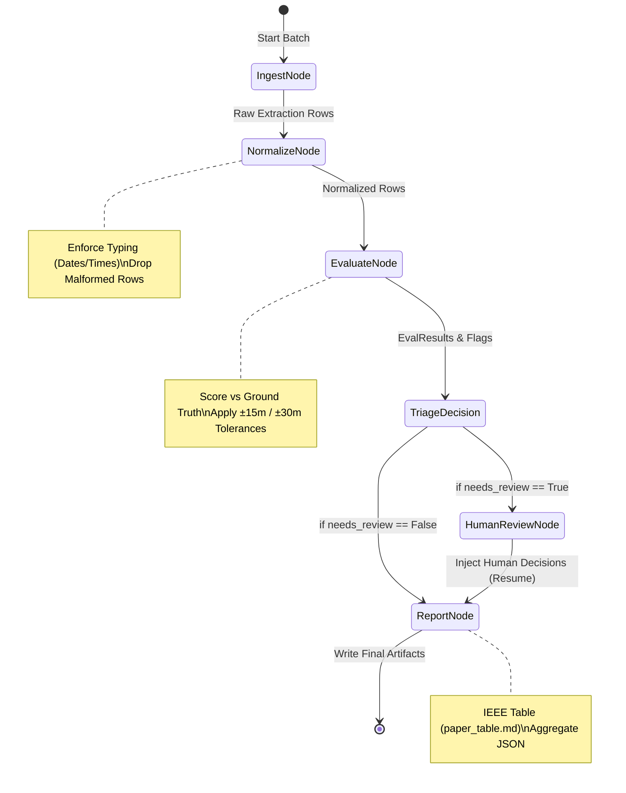
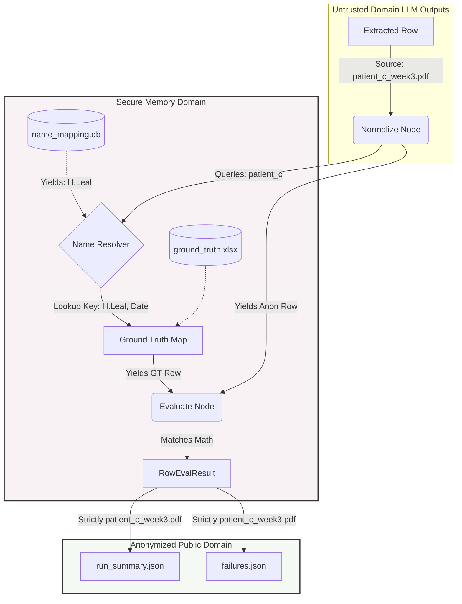
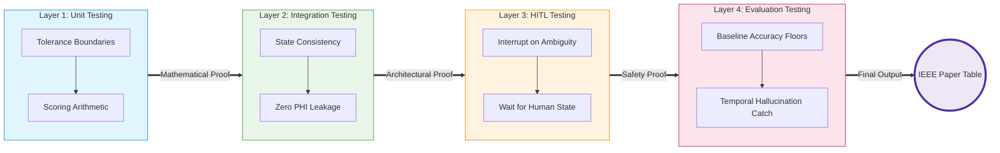
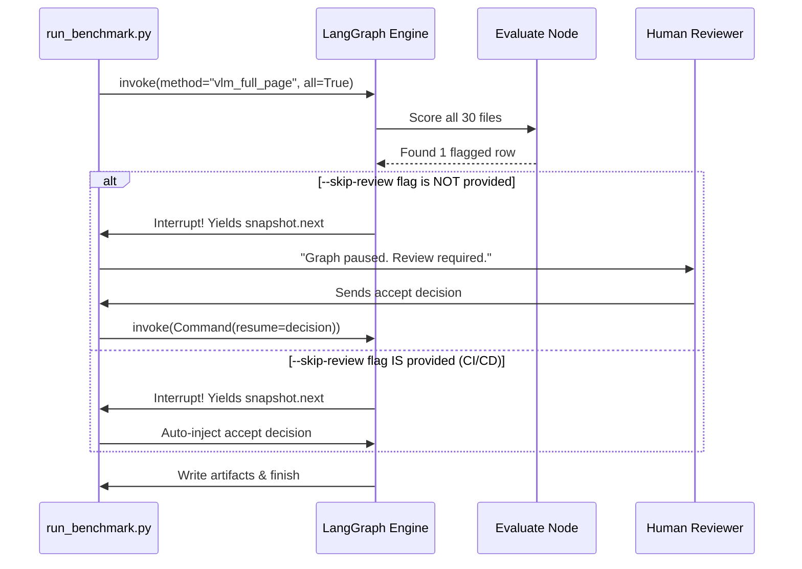

# IEEE Paper Diagrams: Document Extraction Benchmark

The following Mermaid diagrams visualize the core methodology and architectural achievements of the benchmarking pipeline. They are formatted specifically for inclusion in academic IEEE papers.

---

## 1. The Stateful LangGraph Workflow
This diagram illustrates the state machine transitioning data from raw extraction through normalization, evaluation, and conditionally halting for human review (HITL) before final reporting.

---

## 2. PHI Isolation & The One-Way NameResolver
This diagram proves to reviewers how the pipeline handles real patient data (PHI) mathematically without ever leaking it into the final public artifacts.

---

## 3. The Four-Layer Testing Methodology
This diagram illustrates the cascading safety guarantees of the pipeline. If any layer fails, the pipeline halts, preventing flawed metrics from reaching the IEEE results table.

---

## 4. Pipeline Execution (Automated vs. Manual Run)
A sequence diagram demonstrating how the CLI handles batch automation compared to a single-file manual review scenario.

